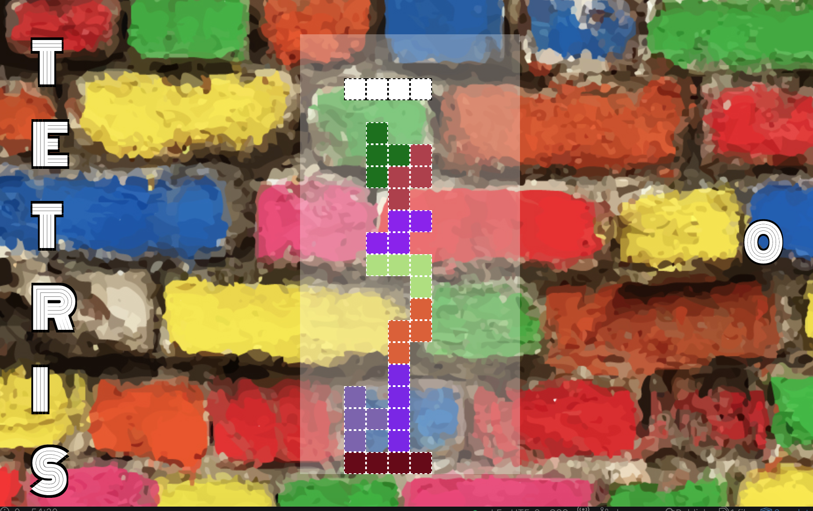
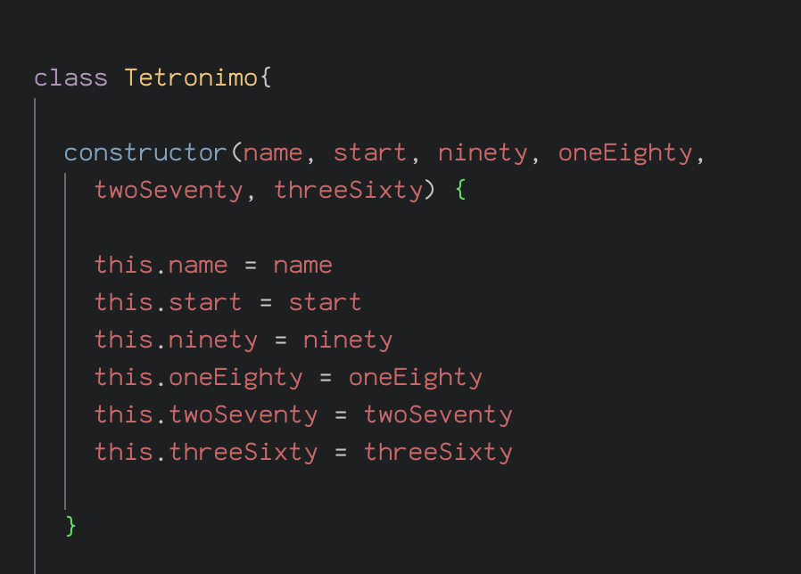
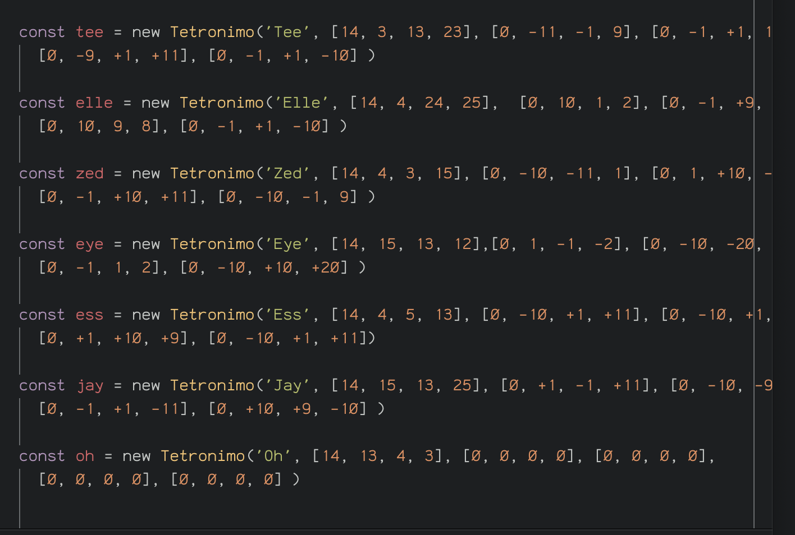
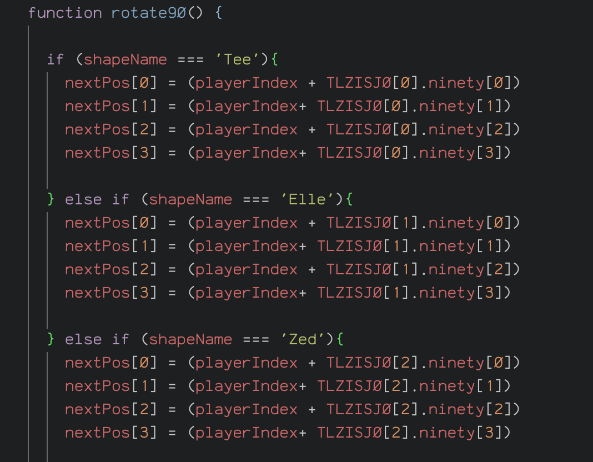

 
# General Assembly Software Engineering - Project 1

# Tetris

### Project \#1 Game

**HTML CSS JavaScript(ES6)**

A Tetris "Clone" built using JavaScript, HTML5 and CSS3.


## Introduction

It should be emphasised at the outset that I am not very satisfied with the JavaScript code that I produced during this week. I have since returned to Tetris and have re-done it (in a very basic form) to put my mind at rest. The new version can be seen in the JavaScript file "take-two".  While I created it as part of this repo, it was not part of the project so I have left the original code as the source of the live game.



I have also left all evidence of my original struggles within the unused JavaScript files, scripts.js, app.js and save.js. I have learnt a lot since this project and I feel these files are an important reminder of how far I have come!

### Project Specification and Summary of Process

This is Project 1 of General Assembly Software Engineering Immersive.

While the goal of this project was to put into practice the skills learned during the first unit of the course I decided to push myself as much as possible. I chose to take on one of the more difficult briefs and to build the game with as little input from outside sources as possible. I knew this was a risky approach but that it would be push me to think creatively.  

### Technical Requirements

Technical Requirements:

- Display a game in the browser
- Design logic for winning & visually display which player won
- Include separate HTML / CSS / JavaScript files
- Stick with KISS (Keep It Simple Stupid) and DRY (Don't Repeat Yourself) principles
- Use Javascript for DOM manipulation
- Deploy the game online.
- Use semantic markup for HTML and CSS (adhere to best practices)

### How to play:

* Left, Right and Down arrows correspond to direction.
* Space Bar controls (the rather clunky!) rotation of the falling piece.


### The Board

The **Board** is a dynamically generated JavaScript grid. It was created using the function shown below. Extra invisible rows were added at the top and bottom to provide "buffer" zones and to simplify the handling of win/lose conditions.

```js
function init() {
  const grid = document.querySelector('.grid')
  for (let i = 0; i < width * (width*2) + width + width; i ++) {
    const square = document.createElement('div')
    square.classList.add('grid-item')
    square.dataset.index = i
    squares.push(square)
    grid.append(square)
  }
  for (let i = 210; i < 220 ; i ++) {
    squares[i].dataset.row = 0
    squares[i].style.display = 'none'
  }
  for (let i = 0; i < 10 ; i ++) {
    squares[i].dataset.row = -1
    squares[i].style.opacity = 0
  }

```


**The Tetrominos**

I decided to code each Tetronimo as an object containing rotation keys with array values containing four numbers, each number corresponding to the difference in grid index at each 90, 180, 270 and 360 degree rotation from the starting point.

The Tetronimos themselves were stored in one array.

```javascript
const TLZISJ0 = [
  {
    name: 'Tee',
    start: [14, 3, 13, 23],
    zero: [0, -11, -1, 9],
    ninety: [0, -1, +1, 10],
    oneEighty: [0, -9, +1, +11],
    twoSeventy: [0, -1, +1, -10]
  },
```

I originally attempted to use a constructor function for this to improve the efficiency of my code. While I was much more satisfied with the look (and length) of this alternative version of my code, there were untrace-able bugs that led to the rotations not working meaning that I was forced to revert to the much less DRY original version.





#### Moving Piece

I included two check functions for either direction to contain the piece within the grid and one to check for the bottom.

To move the piece down the board the width is added to each value in the array and to move from left to right adding/subtracting one respectively.

These movements are controlled by corresponding arrow key-press events. The spacebar controls the rotations.

SetInterval is used to automatically move the piece down the board.


#### Fixing Piece in Place

The movement of the Tetronimo applies the class of "fixed" to the appropriate grid areas corresponding to movement type only if all space checking functions return true. If the functions return false this does not happen so the Tetronimo fixes in place by default.

I had difficulties using array methods successfully throughout this project, when trying to refactor very longwinded code using methods such as forEach I found that my code would break for reasons that I could not determine. This led me to revert to much less DRY versions of my code that while not concise or clever, at least worked!

#### Rotating Piece

Nowhere is this more evident than in the code for the rotations of each tetronimo.



#### Challenges

#### Clearing Rows

Implementing a successful row clearing function was the biggest challenge I faced during this project. And while I understood the theory and logic of how this could be achieved I had enormous difficulty putting this into practice.

In theory I wanted to be regularly checking the length of each row (an array) and if the length equalled 10 (the width) I wanted to remove the class of 'fixed' from every 'fixed' grid area and reapply it to the grid area plus the width. Thus shifting all fixed squares one row down. The problem (or one of the problems!) that I encountered was in storing the index value before it would have to be used (plus the width). I attempted to store these values temporarily but the methods I tried did not work when put into practice. Ultimately I resorted to a far from satisfactory method of row clearing that involved using two separate "fixed" classes.

```js
  rows.forEach((row) => {
      if(row.length === 10){
        scoreTracker += 1
        for(let i = 0; i < squares.length; i++) {
          if(squares[i].className === 'grid-item fixed') {
            console.log(squares[i])
            squares[i+10].classList.add('fixed-two')
            squares[i].classList.remove('fixed')
            squares[i].style.backgroundColor= 'white'
            row = []
            if (squares[i].className === 'grid-item fixed-two') {
              scoreTracker += 1
              squares[i+10].classList.add('fixed')
              squares[i].classList.remove('fixed-two')
              squares[i].style.backgroundColor= 'white'
              row = []

            }
          }
        }
      }

    })
  }
  
 ```
#### Wins and Key Learnings

Despite not being entirely happy with the final version of the game that I produced in the original week I learnt an immense amount due to the number of hours I put in attempting to solve the various problems I faced along the way. I used array methods that I had never had any practical experience before (such as Reduce). I was also very happy with my implementation of a constructor function that existed in one version of my code. I now feel comfortable with using constructors having previously had no experience of this. 


*References:*


 The original game was created with very minimal input from any outside source as I resisted Googling at the outset.

When I returned to the project after finishing the course I did not resist Googling and re-made the game over the course of one day after looking at numerous versions from all over the internet. I ended up using this [tutorial](https://www.thatsoftwaredude.com/content/8519/coding-tetris-in-javascript-part-1) but without referencing it as I worked, I read it beforehand, did my best to understand every step and then implemented it myself.

This was actually still quite challenging to get right in a day and the version I came out with is far from perfect. It is however much more concise and infinitely cleaner than my original. It is very satisfying to fully understand how "it should have been done" and it was a very heartening experience to look over my code from just 10 weeks ago and realise how far I have come!
